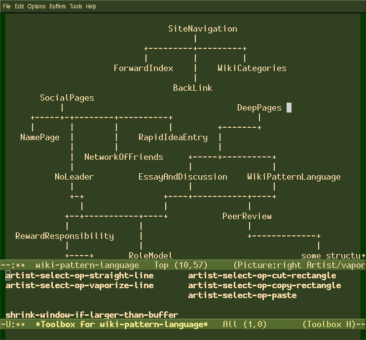

# Toolbox

The toolbox package allows you to call `M-x toolbox` to create a
*toolbox* for your current buffer. The current buffer becomes the
*target* for the toolbox. In the toolbox, you put some elisp commands,
and hit `C-c C-c`. When you now click on them using the middle mouse
button or RET, the command will be run in the target buffer.

Basically, the toolbox is a menu as big as the entire buffer where you
can mix help text and commands, and easily run them on your target
buffer.

In the example below, see how I put the the operations I use most of
the time in my toolbox, making it much simpler to switch drawing ops
in Artist Mode.

